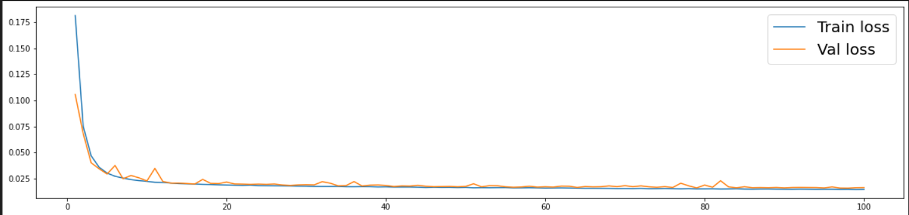
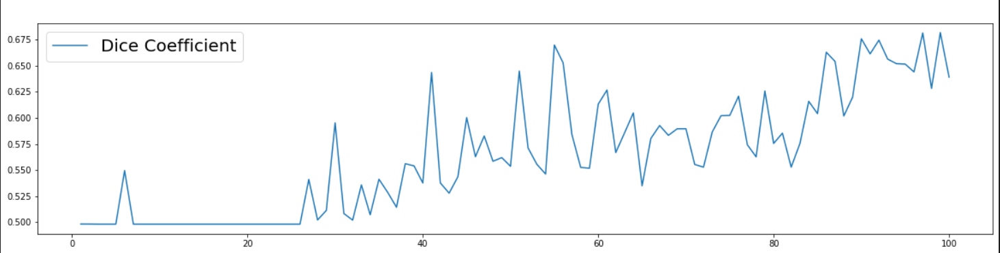

# Semantic-Segmentation-using-UNET-on-MRI-scan-images-of-heart
The data set consists of 30 MRI scans of the entire heart acquired for single cardiac phase free breathing. The corresponding target ROI was the left atrium. The predicted masks were compared to the ground truth masks.

# Generated Masks and comparison with Ground Truth Masks

# Trainig Loss & Validation Loss Curves"

# Dice similarity coefficient

